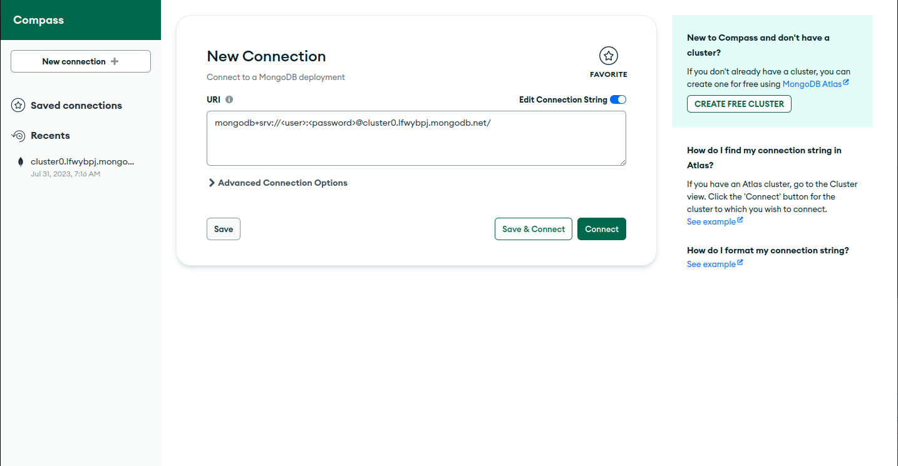

## Mongo DB  

Cuando hablamos de bases de datos tendemos a pensar en SQL y el modelo de bases de datos relacional, pero existen alternativas como los modelos no relacionales donde MongoDB es quizá el ejemplo más destacado.

MongoDB (del inglés humongous, "enorme") es un sistema de base de datos NoSQL orientado a documentos de código abierto y escrito en C++, que en lugar de guardar los datos en tablas lo hace en estructuras de datos BSON (similar a JSON) con un esquema dinámico. Al ser un proyecto de código abierto, sus binarios están disponibles para los sistemas operativos Windows, GNU/Linux, OS X y Solaris y es usado en múltiples proyectos o implementaciones en empresas como MTV Network, Craigslist, BCI o Foursquare.

## Inicialización del proyecto. 

- Clonamos el proyecto en un directorio. 
- Entramos al directorio clonado

```bash
> git clone https://github.com/TheHackBoxCampus/mongoDB_practice.git
> cd mongodb_practice 
```

## Conexión con MongoDB Atlas | Conexion desde la nube 

Para que podamos ejecutar el script ``'query.mongodb'`` tenemos que conectarnos con ``mongo``, existen varias formas de utilizar mongo
te puedes conectar al loopback o directamente al cloud con mongo db ``ATLAS``

En esta ocasión se estara utilizando ``mongodb atlas`` para registrar los documentos en la nube.

Requerimientos:

- Tener una cuenta de mongoDB ``atlas`` 
- ! si no tienes una cuenta puedes consultar este video y realizar el proceso: https://youtu.be/hXyIv_vKdUs
- Tener autenticacion para conectarse con ``atlas``, es decir consultar un enlace como el siguiente: 

```txt
> mongodb+srv://<user>:<password>@<cluster>/

// user => escriba su usuario
// password => escriba su contraseña
// cluster => consultelo en mongo atlas en su database. Es propio NO generico
``` 
- Una vez ya consultado puede conectarte con ``mongoDB compass`` o con la extension de **visual studio code** -> ``mongoDB`` 
 
### Mongo DB Compass



### Mongo DB Extension de VSCODE 


- Cualquiera de las 2 opciones son validas, depende de gusto y comodidad

### Funcionamiento del proyecto.

Dentro del directorio padre ``mongodb_practice`` encontraremos un archivo ``query.mongodb``  en la ruta principal (``/``).

Donde estaran las consultas para crear el siguiente modelo relacional


## Contacto 

Nombre: **MILLER KALED NARIÑO IBARRA**

email: **kalednarino@gmail.com** 
