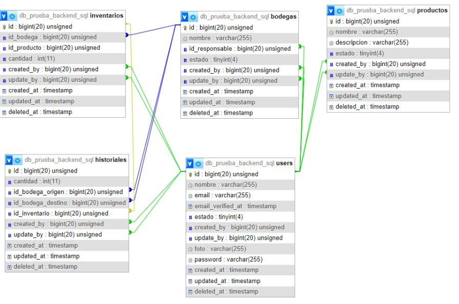

## Mongo DB  

Cuando hablamos de bases de datos tendemos a pensar en SQL y el modelo de bases de datos relacional, pero existen alternativas como los modelos no relacionales donde MongoDB es quizá el ejemplo más destacado.

MongoDB (del inglés humongous, "enorme") es un sistema de base de datos NoSQL orientado a documentos de código abierto y escrito en C++, que en lugar de guardar los datos en tablas lo hace en estructuras de datos BSON (similar a JSON) con un esquema dinámico. Al ser un proyecto de código abierto, sus binarios están disponibles para los sistemas operativos Windows, GNU/Linux, OS X y Solaris y es usado en múltiples proyectos o implementaciones en empresas como MTV Network, Craigslist, BCI o Foursquare.

## Inicialización del proyecto. 

- Clonamos el proyecto en un directorio. 
- Entramos al directorio clonado

```bash
> git clone https://github.com/TheHackBoxCampus/mongoBodegas.git
> cd mongoBodegas
```

## Instala las dependencias 

- En la carpeta del proyecto
- Ejecuta el comando: 

```bash
npm install
```


## Crea el archivo de enviroments: 

- En la raiz del proyecto, crea un archivo ``.env``

- Configura las propiedades: Servidor de express, datos de mongodb atlas, key de token 

```text
SERVER={"...": "localhost", "port": ...}
USERDB={"username": "...", "password": "...", "database": "..."}
KEY="..."
```

## Cluster de Mongo DB atlas

Para que podamos ejecutar el script ``'query.mongodb'`` tenemos que conectarnos con ``mongo``, existen varias formas de utilizar mongo
te puedes conectar al loopback o directamente al cloud con mongo db ``ATLAS``

En esta ocasión se estara utilizando ``mongodb atlas`` para registrar los documentos en la nube.

Requerimientos:

- Tener una cuenta de mongoDB ``atlas`` 
- ! si no tienes una cuenta puedes consultar este video y realizar el proceso: https://youtu.be/hXyIv_vKdUs
- Tener autenticacion para conectarse con ``atlas``, es decir consultar un enlace como el siguiente: 

```txt
> mongodb+srv://<user>:<password>@<cluster>/

// user => escriba su usuario
// password => escriba su contraseña
// cluster => consultelo en mongo atlas en su database. Es propio NO generico
``` 
- Una vez ya consultado puede conectarte con ``mongoDB compass`` o con la extension de **visual studio code** -> ``mongoDB`` 
 
### Mongo DB Compass


### Mongo DB Extension de VSCODE 


- Cualquiera de las 2 opciones son validas, depende de gusto y comodidad


## Modifica el cluster en el proyecto
- Una vez que tengas el cluster 
- Dirigite a la ruta ``src/config/db.js``
- Cambia el cluster:

#### Nota: La propiedad ``globalProperties`` viene del archivo ``src/env/env.js``
```js
let credentials = JSON.parse(globalProperties.USERDB); // Puedes cambiar el nombre de la variable o dejarlo asi.
let uri = "mongodb+srv://${credentials.username}:${credentials.password}@<cluster>${credentials.database}" 
// cambia el cluster por el que tienes en mongodb atlas
```

## Conexion a mongo db con el client 

- Te puedes conectar de esta forma:

```js
import { MongoClient } from "mongodb";
import globalProperties from "../env/env.js";

const conx = async () => {
    try {
        let credentials = JSON.parse(globalProperties.USERDB);
        let uri = "mongodb+srv://${credentials.username}:${credentials.password}@<cluster>${credentials.database}";
        let options = {
            useNewUrlParser: true,
            useunifiedtopology: true
        }
        let client = await MongoClient.connect(uri, options);
        console.log("db --> success");
        return client.db(); 
    }catch(err) {
        console.error(err.message)
    }
}

export default conx; 
```

## Transpila los archivos .*ts (typescript)

- En el archivo package.json
- Encontraras en los scripts. El siguiente comando: 

```json
"scripts": {
    "tsc": "tsc -w" 
}
```

- Para ejecutarlo y transpilar los archivos ejecuta el comando en la terminal, de la siguiente manera:

```bash
npm run tsc
```

- Esto transpilara los archivos ts a javascript en la ruta ``src/storage/structure``


#### Para que esto funcionara:

Por default en el proyecto, vendra un archivo ``tsconfig.json``, donde estaran las configuraciones del compilador para cambiar los *.ts a *.js 

- No toques esta parte
- Puedes consultar mas en las paginas oficiales

```json
{
    "compilerOptions": {
        "target": "ES6",
        "module": "ES6",
        "moduleResolution": "node",
        "outDir": "src/storage/structure",
        "esModuleInterop": true,        
        "experimentalDecorators": true,
        "emitDecoratorMetadata": true
    },
    "include": [
        "src/storage/structure/*.ts"
    ],

    "exclude": [
        "src/storage/structure/*.js"
    ]
}
```

## Poner en escucha el servidor de express:

- En el archivo package.json
- Encontraras en los scripts. El siguiente comando: 

```json
"scripts": {
    "dev": "nodemon --quiet src/index.js"
}
```

- Para ejecutarlo y poner en escucha al servidor: escribe en la terminal

```bash
npm run dev
```

## ¿Como se configuro el servidor?

- ** EJEMPLO DE USO ** 
- Este ejemplo no tiene uso en el proyecto, es instructivo para el entendimiento del express.

Para que los endpoints tengan funcionamiento con el `` Router ``  de express, primero tenemos que desplegar un servidor 
```js
import express from 'express';
let app = express();

let config = {
    hostname : "IP",
    port: "port"
};

app.listen(config, () => {
    console.log(`server lanzado en http://${config.hostname}:${config.port}`);
})
```
Configuramos los middleware para que acepte valores json y de texto
```javascript
import express from 'express';
let app = express(); 
// middleware
app.use(express.text())
app.use(express.json())
```
Con el ``Router`` de express en nuestro archivo app.js definimos la ruta principal llamada dbCampus
```javascript
// importamos las rutas de nuestro archivo routes, /* mas informacion mas adelante */
import express from 'express';
import router from './router/routes.js'
let app = express(); 

app.use("consultas", router); 
```

## Enrutado con Router / Express 
### Consultas HTTP en Router / Express

- ** EJEMPLO DE USO ** 
- Este ejemplo no tiene uso en el proyecto, es instructivo para el entendimiento del router y la conexion de mongodb con el client.

- Importar el MODULO ``Router`` de express
- importar la conexión exportada de mongo db

```javascript
import { Router } from "express";
import { conx } from "../config/db.js";

let router = Router(); 

// diferentes metodos get, post, put, delete
router.get("/", async (req, res) => {
    let db = await conx();
    let bodegas = await db.collection("bodegas");
    let consulta = await bodegas.find().toArray(); 
    res.send(consulta)
} )
```

### Dependencias del proyecto 

En esta seccion te voy a explicar con que funciona el proyecto, Ejemplos genericos para que entiendas el funcionamiento.

### DTO 
Tus datos necesitan seguridad, ¿Cómo se puede garantizar una seguridad?, Precisamente con los Data Transfer Object (Transferencia de los datos), El dto es una capa de abstraccion que nos permite transformar y manipular los datos de la forma que queramos, por ende dando validaciones y permisos, lo que hace que tus datos lleguen de manera mas segura al backend de tu aplicacion.

Para la utilizacion de los dto: 
-  Se utilza javascript tipado, teniendo en cuenta de que typescript se compila a javascript y el funcionamiento de los tipados es unicamente en el proceso de compilación no de ``Ejecucion`` 
- Por lo mismo se utilizan las librerias, para informar los errores cuando se detecten en la compilacion

### Ejemplo de un dto con los decoradores
```ts
// libraries 
import { Transform, Expose } from "class-transformer";

class CLASS {
  @Expose({ name: "prop" })
  @Transform(({ value }) => {
     // * validations
  })
  prop: number;
  constructor(prop: number) {
    this.prop = prop;
  }
}

export default CLASS;
```

## JWT (Json Web Tokens)
Los datos estan un poco mas sanitizados pero ¿Cómo puedo autorizar al usuario o dar permisos al usuario?, El algoritmo HS256 del tipo JWT permite crear tokens, que son los tokens, El token es una referencia (un identificador) que regresa a los datos sensibles a través de un sistema de tokenización.

### ¿Que funcionamiento tienen los tokens?
En el mismo se define un mecanismo para poder propagar entre dos partes, y de forma segura, la identidad de un determinado usuario, además con una serie de claims o privilegios.

Estos privilegios están codificados en objetos de tipo JSON, que se incrustan dentro de del payload o cuerpo de un mensaje que va firmado digitalmente.

### Ejemplo de token


### Estructura de un token 


* Header: encabezado dónde se indica, al menos, el algoritmo y el tipo de token, que en el caso del ejemplo anterior era el algoritmo HS256 y un token JWT.

* Payload: donde aparecen los datos de usuario y privilegios, así como toda la información que queramos añadir, todos los datos que creamos convenientes.

* Signature: una firma que nos permite verificar si el token es válido, y aquí es donde radica el quid de la cuestión, ya que si estamos tratando de hacer una comunicación segura entre partes y hemos visto que podemos coger cualquier token y ver su contenido con una herramienta sencilla, ¿dónde reside entonces la potencia de todo esto?


### Ejemplo en codigo 
Para la utilización del token JWT, se puede implementar con la libreria jsonwebtokens, pero en este caso aprovechando los modulos de la libreria ``jose``
```js
import jwt from "jsonwebtoken";
```
Verificar el token:
```js
// jwtverify
 jwt.verify(token, globalProperties.KEY, { algorithms: "HS256" }, (err, decoded) => {
        err ? cb(err) : cb(null, decoded, { scope: "*" })
})
```
Crear el token:
```js
// Sign
 let token = new Promise((resolve, reject) => {
    jwt.sign(payload, globalProperties.KEY, {algorithm: "HS256", expiresIn: "10m"}, (err, token) => {
         err ? reject(err) : resolve(token) 
    })
})
```

## Passport-http-Bearer

Informacion Oficial:

**"El módulo Passport-http-bearer proporciona una estrategia Passport para autenticar tokens de portador utilizados de acuerdo con el esquema de autenticación de HTTP Bearer.**

**Los tokens de portador son una credencial que puede utilizar cualquier parte en posesión del token para obtener acceso a un recurso protegido. El uso de un token de portador no requiere ninguna credencial adicional, como una clave criptográfica. Como tales, los tokens al portador deben protegerse contra la divulgación tanto en el almacenamiento como en el transporte para poder utilizarlos de forma segura.**

**El esquema de autenticación de Bearer está especificado por RFC 6750. Este esquema fue diseñado para usarse con tokens de acceso emitidos usando OAuth 2.0. Sin embargo, este esquema se puede utilizar dentro del marco general de autenticación HTTP (RFC 7235) y también se puede utilizar para autenticar tokens de portador emitidos a través de otros mecanismos".**


### Ejemplo de uso

- importa la estrategia 
```js
import {Strategy as BearerStrategy} from "passport-http-bearer"
```

- Ejemplo generico para la configuración de la libreria.
 
```js
new BearerStrategy(function(token, cb) {
  tokens.findOne({ value: token }, function(err, claims) {
    if (err) { return cb(err); }
    if (!claims) { return cb(null, false); }

    users.findOne({ id: claims.userID }, function (err, user) {
      if (err) { return cb(err); }
      if (!user) { return cb(null, false); }
      return cb(null, user, { scope: claims.scope });
    });
  });
});
```

## Morgan 

Informacion Oficial: 

**"Morgan: Morgan es un Middleware de nivel de solicitud HTTP. Es una gran herramienta que registra las solicitudes junto con otra información dependiendo de su configuración y el ajuste preestablecido utilizado. Resulta muy útil durante la depuración y también si lo desea. para crear archivos de registro."**

### Ejemplo de uso:

Importa el paquete de morgan 


```js
import morgan from "morgan" // es6
```

- En el archivo app.js en los middleware agrega esta linea de codigo:

```js
app.use(morgan("dev")) // mode dev => detect HTTP requests
```

- Te permitira ver el estado de las peticiones que se hacen al servidor, cuantas se han hecho y a que ruta. 

## Express-rate-limit 

Informacion Oficial: 

**La limitación de velocidad es una estrategia que puede utilizar para controlar el tráfico en una red. Limita la cantidad de solicitudes que un usuario puede realizar dentro de un período de tiempo específico.**

Ejemplo de uso: 

- Configuracion 

```js
import rateLimit from 'express-rate-limit'

const limiter = rateLimit({
	windowMs: 15 * 60 * 1000, // 15 minutes
	max: 100, // Limit each IP to 100 requests per `window` (here, per 15 minutes)
	standardHeaders: true, // Return rate limit info in the `RateLimit-*` headers
	legacyHeaders: false, // Disable the `X-RateLimit-*` headers
	// store: ... , // Use an external store for more precise rate limiting
})
```

- Utiliza la funcion limiter en las rutas 
- Pasalo como middleware

```js
router.get("/", limiter(), (req, res) => res.send("hello world!"))
```

## @iamtraction/google-translate

Esta libreria se encarga traducir porciones de texto al idioma especificado, en este caso ese es el uso que se le aplico al proyecto.

Ejemplo de uso: 

```js
import translate from "@iamtraction/google-translate";

translate('Thank you', { from: 'en', to: 'fr' }).then(res => {
  console.log(res.text); // OUTPUT: Je vous remercie
  console.log(res.from.autoCorrected); // OUTPUT: true
  console.log(res.from.text.value); // OUTPUT: [Thank] you
  console.log(res.from.text.didYouMean); // OUTPUT: false
}).catch(err => {
  console.error(err);
});
```

### Funcionamiento del proyecto.

Dentro de la ruta ``src/services`` encontraras un ``query.mongodb``

Donde estaran las consultas para crear el siguiente modelo relacional



### Colecciones:

- Inventarios
- Bodegas
- Historiales
- Usuarios
- productos


## Rutas del proyecto 

- Ruta principal

```txt
http://${hostname}:${port}/
```

- Despues de esa ruta principal puedes colocar los siguientes **endpoints**
- Cada ruta en su descripcion va tener el ``METODO => ENDPOINT => CATEGORIA DE TOKEN``

## Generar token especifico:

```txt
GET => /generar/:categoria 
```

### En categoria puedes escoger entre: 
---------------
- usuarios
- inventarios
- bodegas
---------------
- En caso contrario te dara excepciones:
- No es necesario enviar datos 
- la categoria debe ir en **MINUSCULA**

- **Te retorna un token con la estructura de la categoria que colocaste**
- Ese token debe ir en el Bearer de las otras rutas 


## Listar Bodegas en orden

```txt
GET => /bodegas/orden => bodegas
```
### Descripcion de la consulta:

```txt
- Realizar un EndPolnt que permita listar todas las bodegas ordenadas alfabéticamente.
```
- No necesita datos de entrada
- El token debe ir, en caso contrario recibiras excepciones


## Crear bodegas

```txt
POST => /bodegas/nueva => bodegas
```

### Descripcion de la consulta: 

```txt
- Realizar un EndPolnt que permita crear una bodegas.(agregar en los
comentarios de la función los datos de entrada).
```

- Datos de entrada: 

```json 
{
     "nombre": "...",
     "id_responsable": 0,
     "estado": 0,
     "created_by": 0,
     "update_by": 0,
     "created_at": "YY-MM-DD",
     "update_at": "YY-MM-DD",
     "deleted_at": "YY-MM-DD"
}
```

- **nombre**: Solo acepta caracteres en minuscula o mayuscula
- **id_responsable**: valor entero 
- **estado**: valor entero
- **created_by**: valor entero
- **update_by**: valor entero
- **created_at**: valor fecha en formato de texto, ejemplo de fecha = "2023-08-16"
- **update_at**: valor fecha en formato de texto, ejemplo de fecha = "2023-08-16"
- **delete_at**: valor fecha en formato de texto, ejemplo de fecha = "2023-08-16"

- Cualquier otro caso, recibiras excepciones: 

## Listar los totales de productos por bodega

```text
GET => /productos/inventario/cantidad => inventarios
```

### Descripcion de la consulta: 

```txt
Realizar un EndPoint que permita listar todos los productos en orden
descendente por el campo "Total".

El campo "Total" es la cantidad de unidades que la empresa tiene
de este producto, considerando la unión de todas las bodegas, es
decir que el dato como tal no existe en la base de datos,sino se debe
calcular. Si la Bodega A tiene 1O unidades, la Bodega B tiene 5
unidades y la Bodega C tiene 3 unidades. Total= 18.
```

- No necesita datos de entrada
- El token debe ir, en caso contrario recibiras excepciones

## Aumentar o actualizar productos por Bodega

```ŧext
POST => /productos/nueva => inventarios
```

### Descripcion de la consulta 

```txt
Realizar un EndPoint que permita insertar registros en la tabla de
inventarios, los parámetros de entrada deben ser
(id_producto,id_bodega,cantidad).

• La tabla no puede repetir la combinación de Bodega I Producto Por lo
tanto será necesario validar si el ingreso que se está realizado ya
existe o es una combinación totalmente nueva.

• Si es una combinación totalmente nueva, se debe hacer un lnsert,
considerando los datos ingresados.

• Si es una combinación existente, entonces se debe hacer un Update
a este registro, considerando la suma de la cantidad existente con la
cantidad nueva.
```

- Datos de entrada: 

```json
{
    "id_bodega": 0,
    "id_producto": 0,
    "cantidad": 0
}
```

- Todos los campos numericos, en caso contario recibiras excepciones

## Trasladar productos de bodega

```ŧext
POST => /productos/transladar => inventarios
```

### Descripcion de la consulta: 

```text
Realizar un EndPolnt que permita Trasladar un producto de una bodega a otra

• Se debe validar que la cantidad de unidades que se pretende sacar
de una Bodega, sea posible, ya que si tengo 1O unidades en la
Bodega A, no podré sacar de ella 20 unidades. Esta acción debe
generar una alerta e impedir el registro.

• Para la afectación de las tablas se debe considerar que del Origen debo
restar la cantidad,y al destino le debo sumar la cantidad.
Por ejemplo: Bodega A = 1O unidades. Bodega B = 1O unidades. Haré
el traslado de 5 unidades desde la Bodega A para la Bodega B, Por lo cual el resultado será hacer Updated a los dos registros en inventarios:
Bodega A = 5 unidades. Bodega B = 15 unidades. Además hacer un lnsert con toda la información en la tabla de historiales.
```

- Datos de entrada: 

```json
{
    "id_producto": 0,
    "origen": 0,
    "destino": 0,
    "cantidad": 0
}
```

- Todos los datos numericos
- Los campos ``origen`` y ``destino`` representan a las bodegas, bodega origen y bodega destino


## Contacto 

Nombre: **MILLER KALED NARIÑO IBARRA**

email: **kalednarino@gmail.com** 
